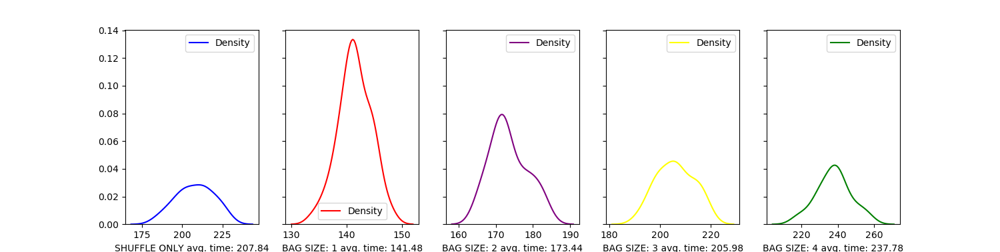
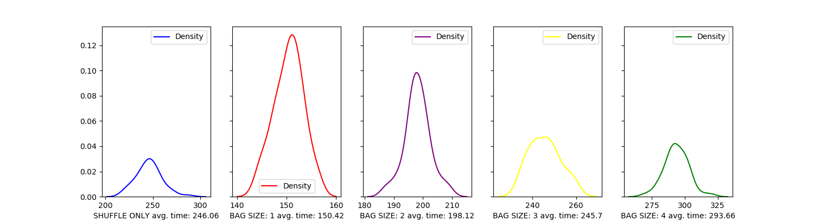

#  Simulation of the plane boarding strategies

The aim of this project it to examine and compare various methods of boarding a plane (16 rows consisting of 6 seats each).
Our implementation is based on ***Mesa*** - an agent-based modeling framework for **Python 3** (more information can be found
on https://mesa.readthedocs.io/).

The visualization can be launched by running file "viz.py" (more details [here](#vizpy)).

To work properly, it requires following libraries installed:
 - **mesa** 
 - **numpy**
 - **pandas**
 - **seaborn**
 - **mathplotlib**

## Implementation - files:

### plane.py

File "*plane.py*" consists of our implementation of 2 types of agents (inheriting from ***Agent*** delivered in *Mesa*) used in our simulation:
 - ***PassengerAgent*** - as the name may suggest, agents of this class represent a single passenger of a plane. 
 Their most important properties are *seat_pos* (position of assigned seat), *group* (number of a boarding group)
 and *baggage* (amount of time necessary to stow luggage). Additionally, every agent has a *state* property, which is 
 used to store information regarding current actions taken by the passenger.  
 - ***PatchAgent*** - this class is used to describe individual cells of the plane. Each patch has assigned type 
 (seat, corridor or wall), which can be used to distinguish them during visualization. However, their most important 
 functionality is provided by containing information used to properly conduct seat shuffles by passengers.
 
 Every agent has assigned *unique_id*, which allows to distinguish agents from each other - a property required 
 by *Mesa*, although it allows for better understanding of consecutive steps of the visualization.
 
 Additionally, this file contains ***PlaneModel*** - our representation of the plane, a core of every simulation - to which
 all agents must be assigned. It consists of numerous variables describing conditions of current run (boarding method or amount of baggage)
 and elements essential for proper functioning of simulation, such as specific grid (**MultiGrid** allowing for multiple agents on a single cell) 
 and scheduler (**QueueScheduler** which is explained below).

### queue_method.py

File "*queue.py*" contains a definition of ***QueueScheduler*** - an extension of *BaseScheduler* delivered by *Mesa*.
Instead of a single agent buffer, the modified version consists of two separate queue - *standard* and *priority*.
Agents placed in priority queue are guaranteed to progress before those in standard one.
Such implementation allows for better control over the flow of simulation, while still being compatible
with most of functions in *Mesa*.

### methods.py

File "*methods.py*" consists of 8 functions representing boarding methods which we are meant to simulate:

 - Random order
 - Back to front
 - Front to back
 - Back to front (4 groups)
 - Front to back (4 groups)
 - Window-middle-aisle
 - Steffen Perfect
 - Steffen "Modified"

### viz.py
File "*viz.py*" consists of elements required for correct visualization of our model. To launch it, ensure that all that 
all files mentioned in this document are located in the same dictionary and execute:

>python3  -m  viz.py

After this in your browser should show up new tab (resembling an image below):

  
The left panel consists of three variables:
 - **Boarding method** (allows for choice of the boarding method)
 - **Enable shuffle** (enables and disables suit shuffles)
 - **Luggage size** (an integer from a range from 0 to 7 or a value drawn from normal distribution)

On the right side, there are three buttons controlling the flow of simulation:
 - **Start/Stop** (turns on and pauses the visualization)
 - **Step** (progresses the simulation by one step)
 - **Reset** (clears the board)
 

### runes.py
File *runes.py* contains batch runs whose are collecting data as time (to fully board all passengers),
and script where we can exam the impact of seat shuffling on the length of the boarding process.
Our results are presented on histograms, where **X axis** is time line 
and **Y axis** is density (https://en.wikipedia.org/wiki/Kernel_density_estimation)

## Results
For each method we provided 100 different runs.
Below there is a graph comparing performance of 8 presented boarding methods: 

The following graphs are meant to visualize the impact of baggage stowing on boarding time in comparison
with effect caused solely by seat shuffles. In both groups, the first chart presents the result when seat shuffles are 
enables and baggage is completely neglected. The following graphs, we compare mean time for disabled seat shuffles and
constant time of stowing baggage (respectively: 1, 2, 3, 4 ticks).

 - **RANDOM**
 

 - **BACK TO FRONT (4 groups)**
 

It can be noticed that baggage and seat shuffles have similar impact when time of stowing luggage is equal to 3 ticks in 
both experiments - with further increase of this value influence of baggage increases significantly.

