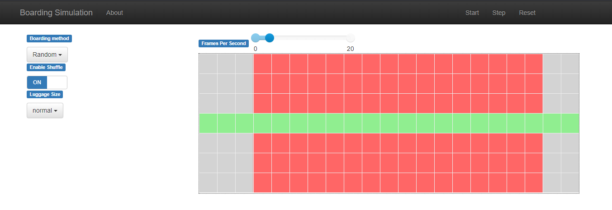
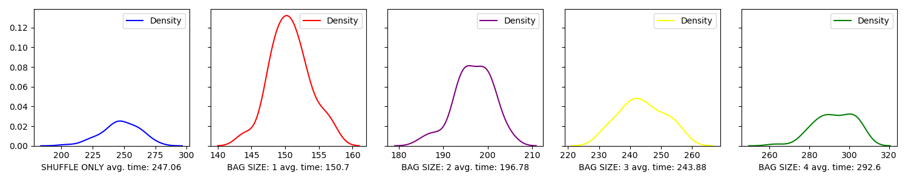
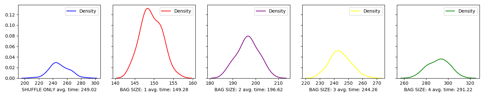
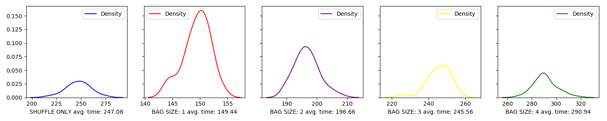

#  Simulation of the plane boarding strategies

The aim of this project it to examine and compare various methods of boarding a plane (16 rows consisting of 6 seats each).
Our implementation is based on ***Mesa*** - an agent-based modeling framework for **Python 3** (more information can be found
on https://mesa.readthedocs.io/).

To work properly, it requires following libraries installed:
 - **mesa** 
 - **numpy**
 - **pandas**
 - **seaborn**
 - **mathplotlib**

# Files:

## plane.py
## queue.py

File "*queue.py*" contains a definition of ***QueueScheduler*** - an extension of *BaseScheduler* delivered by *Mesa*.
Instead of a single agent buffer, the modified version consists of two separate queue - *standard* and *priority*.
Agents placed in priority queue are guaranteed to progress before those in standard one.
Such implementation allows for better control over the flow of simulation, while still being compatible
with most of functions in *Mesa*.

## methods.py

File "*methods.py*" consists of 8 functions representing boarding methods which we are meant to simulate:

 - Random order
 - Back to front
 - Front to back
 - Back to front (4 groups)
 - Front to back (4 groups)
 - Window-middle-aisle
 - Steffen Perfect
 - Steffen "Modified"

## viz.py
This is visualization file. Simply if u want to see how it works, put all files in one directory and use this command:

>python3  -m  viz.py

After this in your browser should show up new tab (resembling an image below):

  
The left panel consists of three variables:
 - **Boarding method** (allows for choice of the boarding method)
 - **Enable shuffle** (enables and disables suit shuffles)
 - **Luggage size** (an integer from a range from 0 to 7 or a value drawn from normal distribution)

On the right side, there are three buttons controlling the flow of simulation:
 - **Start/Stop** (turns on and pauses the visualization)
 - **Step** (progresses the simulation by one step)
 - **Reset** (clears the board)
 

## runes.py
File *runes.py* contains batch runs whose are collecting data as time (to fully board all passengers),
and script where we can exam the impact of seat shuffling on the length of the boarding process.
Our results are presented on histograms, where **X axis** is time line 
and **Y axis** is density (https://en.wikipedia.org/wiki/Kernel_density_estimation)

### Results
For each method we provided 100 diffrent runs.
Below we can see combined chart with results of 8 methods 

Here we can see how size of bags can impact boarding time over seat shuffling.
On first chart are results when luggage stowing does not count, only seat shuffling.
Then on the others we simply increase size of the bags also excluding seat shuffling.
 - **RANDOM**

 - **BACK TO FRONT (4 groups)**

As we can see, when the bag size is around 3, luggage stowing have almost same impact as seat shuffling without bag stowing.

